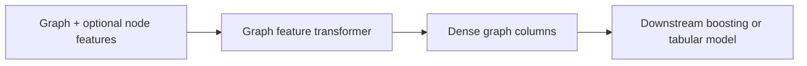

# Graph Feature Workflows

Use graph feature workflows when graph-derived vectors or scalar features
should become dense columns for another estimator. This is best for ablation
studies where the graph is a covariate source rather than the model artifact.

## Workflow

Keep the comparison controlled:

1. Fit the baseline model with the original structured features.
2. Fit graph encoders on train-side graph data only.
3. Transform train and validation rows into graph feature columns.
4. Fit the same downstream model family with the appended graph block.
5. Report whether the graph block improves the same holdout metrics.

## Directional Features

Directional source-target extraction is opt-in. Common generated feature
families include:

- `source_target_embedding`
- `target_source_embedding`
- `forward_reverse_similarity_delta`
- `source_outbound_strength`
- `target_inbound_strength`
- `flow_imbalance_ratio`
- `directed_temporal_drift`
- `source_target_affinity`
- `target_source_affinity`

Generic package names are source-target oriented. Add taxi-specific labels such
as pickup/dropoff or origin/destination in the feature-engineering layer above
CartoBoost.

## Read Next

See [Graph Models And Features](../../graph-features.md) for encoder settings,
directionality options, graph feature bundles, and artifact contracts.
